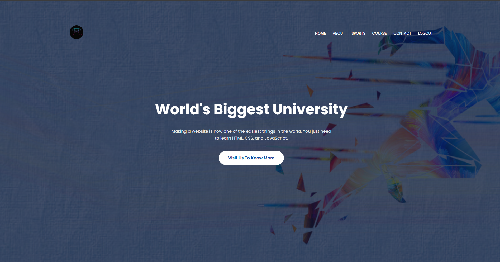
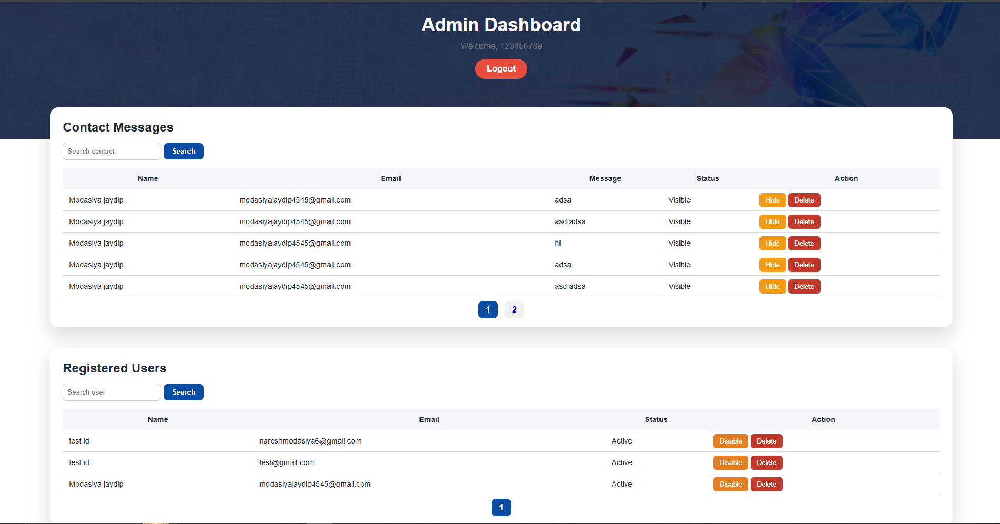
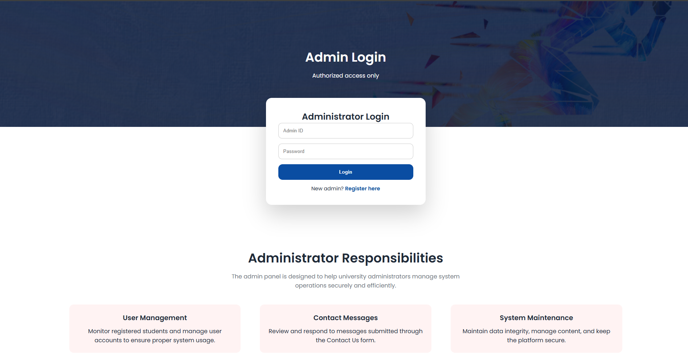
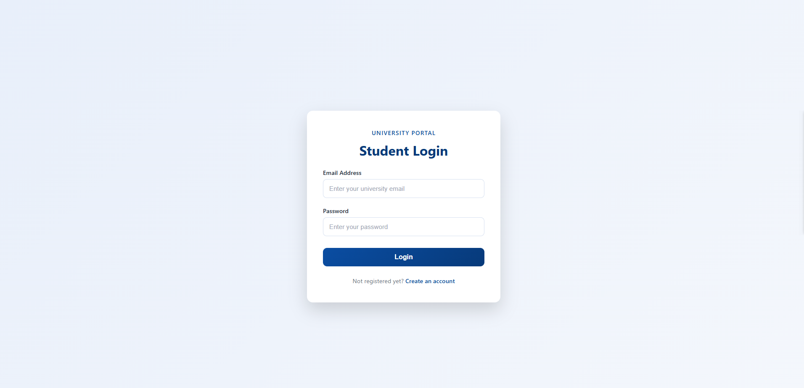
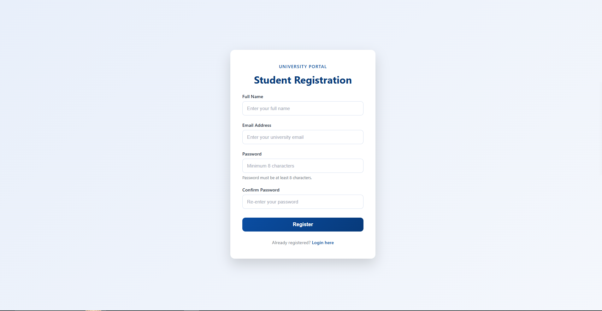
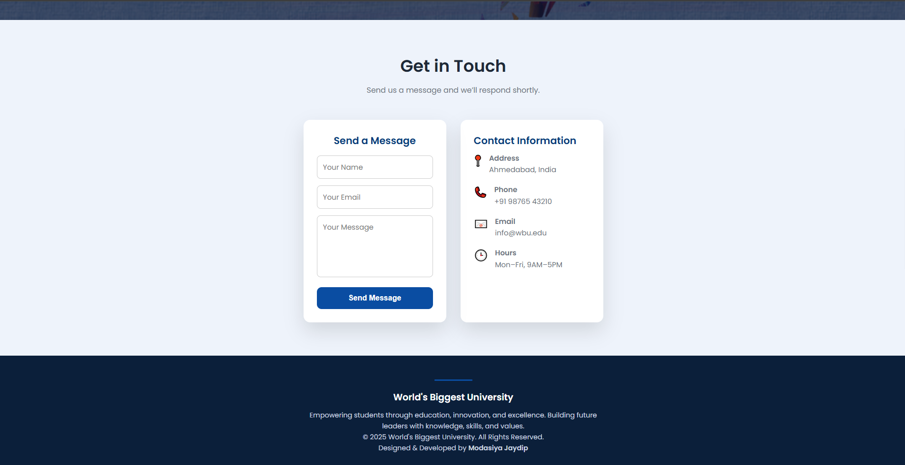
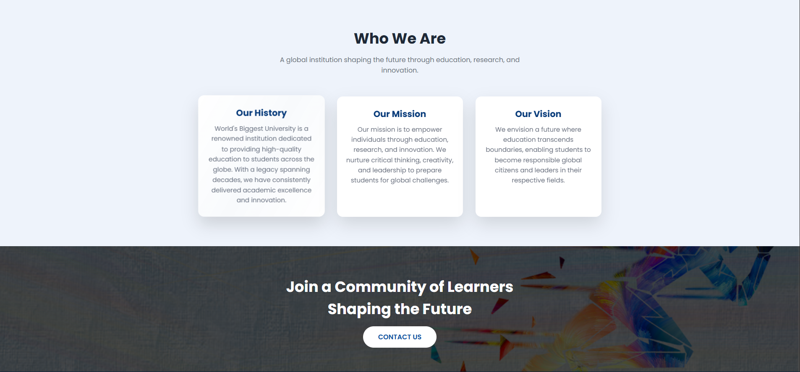
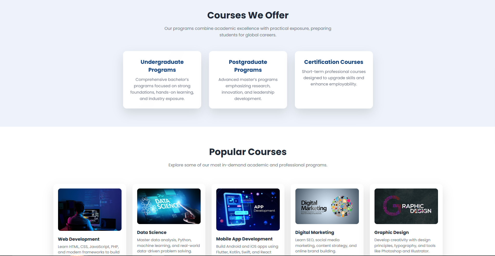

# 🎓 University Portal



A full-stack academic web application for managing university activities with secure interfaces for students and administrators. Built with pure PHP, MySQL, and vanilla JavaScript without any frameworks.

The codebase now uses a lightweight MVC-style structure with shared controllers, repositories, middleware, services, and reusable page helpers to reduce duplicated HTML layout.

[](https://www.php.net/)
[](https://www.mysql.com/)
[](https://developer.mozilla.org/en-US/docs/Web/HTML)
[](https://developer.mozilla.org/en-US/docs/Web/CSS)
[](https://developer.mozilla.org/en-US/docs/Web/JavaScript)
[](https://www.apachefriends.org/)


## ✨ Features

### 👨‍🎓 **Student Portal**
- ✅ Secure registration & login system
- ✅ Browse university information (courses, sports, facilities)
- ✅ Contact form with database storage
- ✅ Enrollment module for student requests
- ✅ Session-based authentication
- ✅ Responsive and clean user interface

### 👨‍💼 **Admin Dashboard**
- 🔐 Secure admin authentication with session timeout
- 📊 Interactive dashboard with statistics
- 👥 User management (enable/disable, soft delete)
- 📩 Contact message management (hide/unhide)
- 🔍 Advanced search functionality
- 📄 Pagination for large datasets
- ♻️ Soft delete for data safety

### 🛡️ **Security Features**
- 🔒 Password hashing with `password_hash()`
- ⏱️ Session timeout protection
- 🚫 SQL injection prevention
- 🛡️ XSS protection
- 🔐 Protected admin routes
- 🧼 Shared input validation and sanitization
- 📫 Automated email notifications with PHPMailer

## 🏗️ Project Structure

```
university_portal/
├── assets/
│   ├── css/
│   │   ├── main.css              # Main site styling
│   │   └── login-Registration.css # Login & Register styling
│   └── images/                   # All website images (logo, screenshots, etc.)
├── database/
│   └── university_portal.sql     # Database schema + sample data
├── index.php                     # Home page
├── about.php                     # About university
├── sports.php                    # Sports page
├── course.php                    # Courses offered
├── contact.php                   # Contact form
├── enrollment.php                # Student enrollment module
├── login.php                     # Student login
├── registration.php              # Student registration
├── admin_login.php               # Admin login
├── admin_register.php            # Admin registration
├── admin.php                     # Admin dashboard
├── admin_logout.php              # Admin logout
├── database.php                  # Database connection
├── app/                          # MVC-style controllers, models, middleware, services
├── USER_GUIDE.md                 # Portal access guide
├── VALIDATION.md                 # Enhancement validation guide
├── UPDATE.md                     # Change log and implementation notes
├── composer.json                 # Composer deps and autoloading
├── .gitignore
└── README.md
```

## 🚀 Setup Notes

1. Run `composer install` to install PHPMailer and generate the autoloader.
2. Import `database/university_portal.sql` to create the `enrollments` table and the soft-delete fields used by the app.
3. Open `enrollment.php` after logging in as a student to test the new enrollment flow and email notifications.
4. Read [USER_GUIDE.md](USER_GUIDE.md) for portal access steps.
5. Read [VALIDATION.md](VALIDATION.md) for the enhancement validation checklist.

## 🗄️ Database Schema

### `users` Table (Students)
```sql
CREATE TABLE users (
    id INT PRIMARY KEY AUTO_INCREMENT,
    full_name VARCHAR(100) NOT NULL,
    email VARCHAR(100) UNIQUE NOT NULL,
    password VARCHAR(255) NOT NULL,
    is_disabled BOOLEAN DEFAULT FALSE,
    is_deleted BOOLEAN DEFAULT FALSE,
    created_at TIMESTAMP DEFAULT CURRENT_TIMESTAMP
);
```
`users` (Students)

| Column      | Purpose               |
| ----------- | --------------------- |
| id          | Primary key           |
| full_name   | Student name          |
| email       | Login email           |
| password    | Hashed password       |
| is_disabled | Enable / Disable user |
| is_deleted  | Soft delete           |
| created_at  | Registration date     |


### `admin` Table
```sql
CREATE TABLE admin (
    id INT PRIMARY KEY AUTO_INCREMENT,
    password VARCHAR(255) NOT NULL,
    created_at TIMESTAMP DEFAULT CURRENT_TIMESTAMP
);
```
`admin` (Admins)

| Column     | Purpose             |
| ---------- | ------------------- |
| id         | Admin ID            |
| password   | Hashed password     |
| created_at | Admin creation date |


### `contact` Table (Messages)
```sql
CREATE TABLE contact (
    id INT PRIMARY KEY AUTO_INCREMENT,
    name VARCHAR(100) NOT NULL,
    email VARCHAR(100) NOT NULL,
    message TEXT NOT NULL,
    is_hidden BOOLEAN DEFAULT FALSE,
    is_deleted BOOLEAN DEFAULT FALSE,
    created_at TIMESTAMP DEFAULT CURRENT_TIMESTAMP
);
```
`contact` (Messages)

| Column     | Purpose       |
| ---------- | ------------- |
| id         | Message ID    |
| name       | Sender name   |
| email      | Sender email  |
| message    | Message text  |
| is_hidden  | Hide / Unhide |
| is_deleted | Soft delete   |
| created_at | Message date  |


## 🚀 Quick Start

### Prerequisites
- [XAMPP](https://www.apachefriends.org/) (Apache & MySQL)
- PHP 7.4+
- MySQL 5.7+
- Web browser

### Installation

1. **Clone the repository**
```bash
git clone https://github.com/jaydipmodasiya/university_portal.git
cd university_portal
```

2. **Set up XAMPP**
   - Install XAMPP from [apachefriends.org](https://www.apachefriends.org/)
   - Move the project folder to `C:\xampp\htdocs\` (Windows) or `/opt/lampp/htdocs/` (Linux)

3. **Start Services**
   - Open XAMPP Control Panel
   - Start **Apache** and **MySQL**

4. **Create Database**
```bash
# Open phpMyAdmin: http://localhost/phpmyadmin
# Create new database: university_portal
# Import: database/university_portal.sql
```

5. **Configure Database Connection**
Edit `database.php` if needed:
```php
$hostname = "localhost";
$dbuser = "root";      // Default XAMPP username
$dbPassword = "";      // Default XAMPP password (empty)
$dbname = "university_portal";
```

6. **Access the Application**
```
Student Portal: http://localhost/university_portal
Admin Login:    http://localhost/university_portal/admin_login.php
```

For a step-by-step usage walkthrough, see [USER_GUIDE.md](USER_GUIDE.md). For validation steps, see [VALIDATION.md](VALIDATION.md).

## 🎯 Default Credentials

### Admin Account
- **Username**: `admin` (default in database)
- **Password**: `admin123` (change after first login)

### Student Account
- Register new account via registration page

## 📸 Screenshots

| Student Home Page | Admin Dashboard |
|-------------------|-----------------|
|  |  |

| Admin Login | Student Login |
|-------------|---------------|
|  |  |

| Registration | Contact Form |
|-------------------|--------------|
|  |  |

| About | Course |
|-----------------|-------------|
|  |  |

## 🔧 Technologies Used

### Backend
- **PHP** - Server-side scripting
- **MySQL** - Database management
- **Sessions** - User authentication
- **PDO/Mysqli** - Database operations

### Frontend
- **HTML5** - Markup structure
- **CSS3** - Styling and layout
- **JavaScript** - Client-side interactivity
- **Responsive Design** - Mobile-friendly UI

### Architecture
- **MVC-style structure** - Controllers, repositories, middleware, and services
- **Shared page helpers** - Reusable layout output for student and admin pages

### Security
- **Password Hashing** - `password_hash()` and `password_verify()`
- **Session Management** - Secure user sessions
- **Input Validation** - Form data sanitization
- **SQL Injection Prevention** - Prepared statements

## 📖 Lessons Learned

### Backend Development
- ✅ Built complete MVC architecture without frameworks
- ✅ Implemented secure authentication system
- ✅ Created RESTful API-like structure
- ✅ Managed database transactions efficiently

### Security Practices
- ✅ Implemented password hashing and verification
- ✅ Added session timeout protection
- ✅ Prevented SQL injection attacks
- ✅ Secured admin routes and endpoints

### Database Management
- ✅ Designed normalized database schema
- ✅ Implemented soft delete functionality
- ✅ Created efficient pagination system
- ✅ Managed database relationships

### UI Refactoring
- ✅ Reduced repeated header/footer HTML with shared helpers
- ✅ Made student and admin pages easier to maintain

### Frontend Development
- ✅ Created responsive UI without frameworks
- ✅ Implemented client-side validation
- ✅ Designed consistent color scheme
- ✅ Built interactive admin dashboard

## 🚀 Deployment

### Local Deployment (XAMPP)
1. Install XAMPP
2. Place project in `htdocs` folder
3. Import SQL file
4. Configure database connection
5. Access via `http://localhost/university_portal`

### Web Hosting
1. Upload files to web server
2. Create MySQL database
3. Import SQL file
4. Update `database.php` with hosting credentials
5. Set proper file permissions (755 for folders, 644 for files)

## 🤝 Contributing

Contributions are welcome! Here's how you can help:

1. **Fork the repository**
2. **Create a feature branch**
```bash
git checkout -b feature/AmazingFeature
```
3. **Commit your changes**
```bash
git commit -m 'Add some AmazingFeature'
```
4. **Push to the branch**
```bash
git push origin feature/AmazingFeature
```
5. **Open a Pull Request**

### Development Guidelines
- Follow existing code style
- Add comments for complex logic
- Update documentation as needed
- Test thoroughly before submitting

## 📄 License

This project is licensed under the MIT License - see the [LICENSE.txt](LICENSE.txt) file for details.

```
MIT License

Copyright (c) 2024 Jaydip Modasiya

Permission is hereby granted, free of charge, to any person obtaining a copy
of this software and associated documentation files (the "Software"), to deal
in the Software without restriction, including without limitation the rights
to use, copy, modify, merge, publish, distribute, sublicense, and/or sell
copies of the Software, and to permit persons to whom the Software is
furnished to do so, subject to the following conditions:

The above copyright notice and this permission notice shall be included in all
copies or substantial portions of the Software.
```

## 👨‍💻 Author

### Jaydip Modasiya
[](https://github.com/jaydipmodasiya)
[](https://www.linkedin.com/in/jaydip-modasiya/)
[](#)

### 🛠️ Technical Skills
**Languages:** PHP, JavaScript, HTML, CSS, SQL, Python, Java  
**Frameworks:** Laravel, React, Bootstrap, Tailwind CSS  
**Databases:** MySQL, PostgreSQL, MongoDB  
**Tools:** Git, Docker, AWS, XAMPP, VS Code, Postman  
**Concepts:** OOP, MVC, REST APIs, Authentication, Security  

### 🌟 GitHub Stats


### 🔗 Connect with Me
- **GitHub**: [@jaydipmodasiya](https://github.com/jaydipmodasiya)
- **LinkedIn**: [@jaydipmodasiya](https://www.linkedin.com/in/jaydip-modasiya)

## ⭐ Show Your Support

If you find this project helpful, please give it a star! ⭐

## 📞 Support & Contact

For queries, suggestions, or contributions:
- 📧 Open an issue on GitHub
- 💬 Discuss in project discussions
- 🔧 Submit a pull request

---

<div align="center">
  
**Made with ❤️ by Jaydip Modasiya**

[⬆ Back to Top](#-university-portal)

</div>
